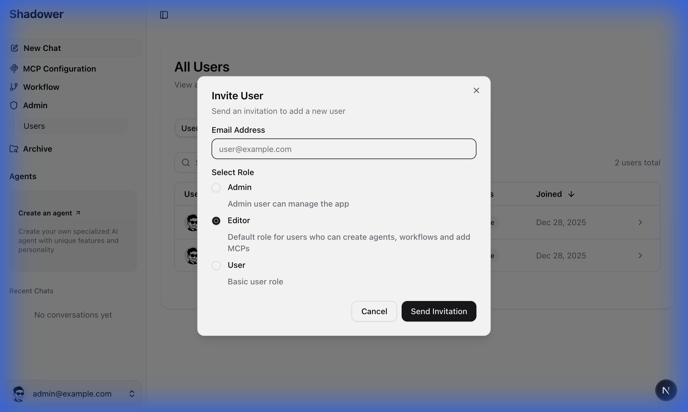
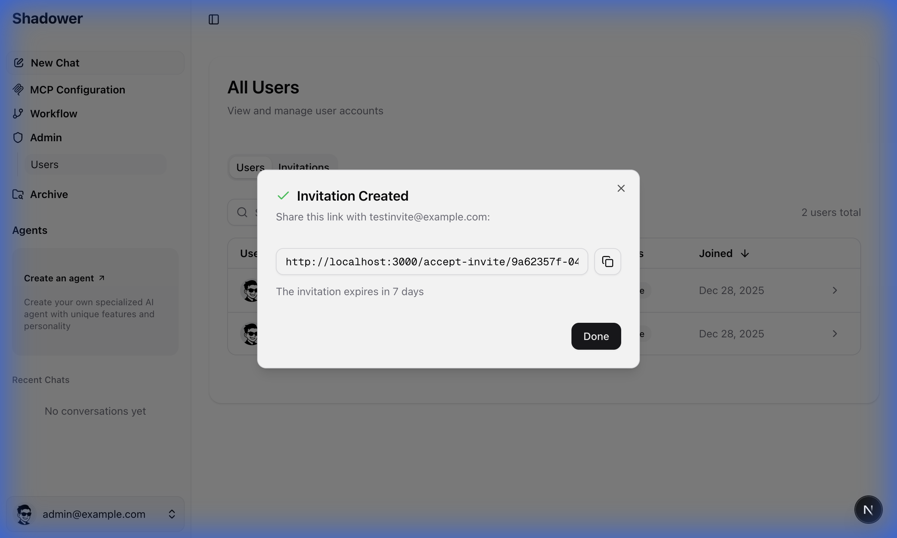
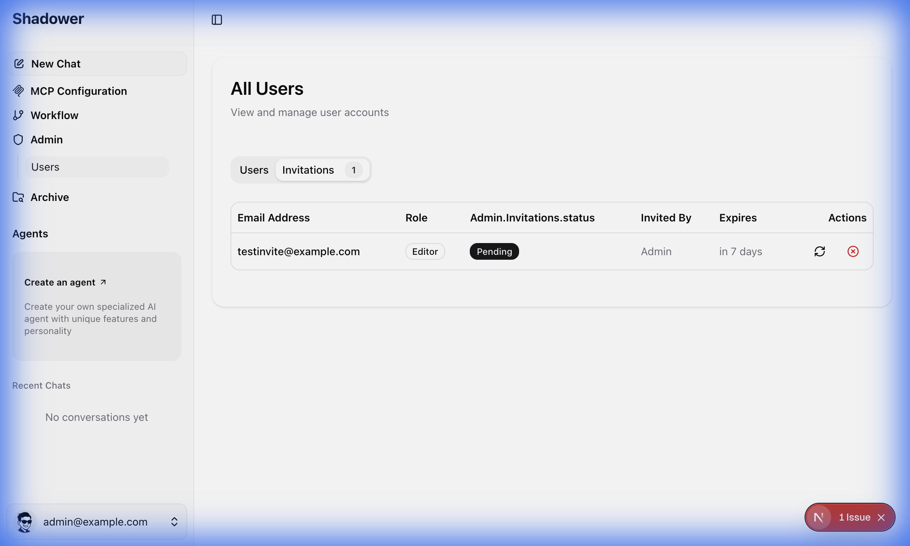
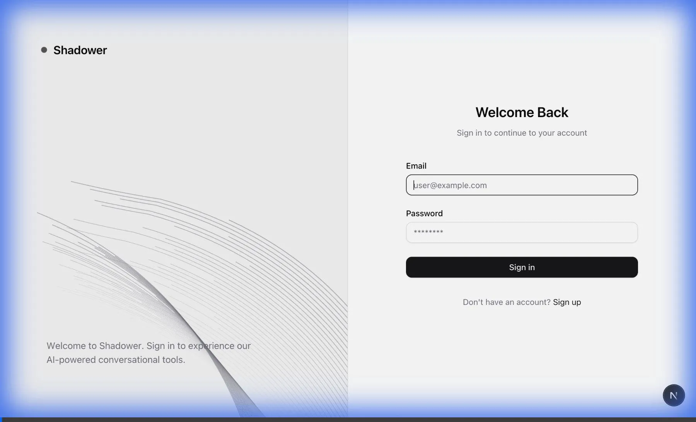
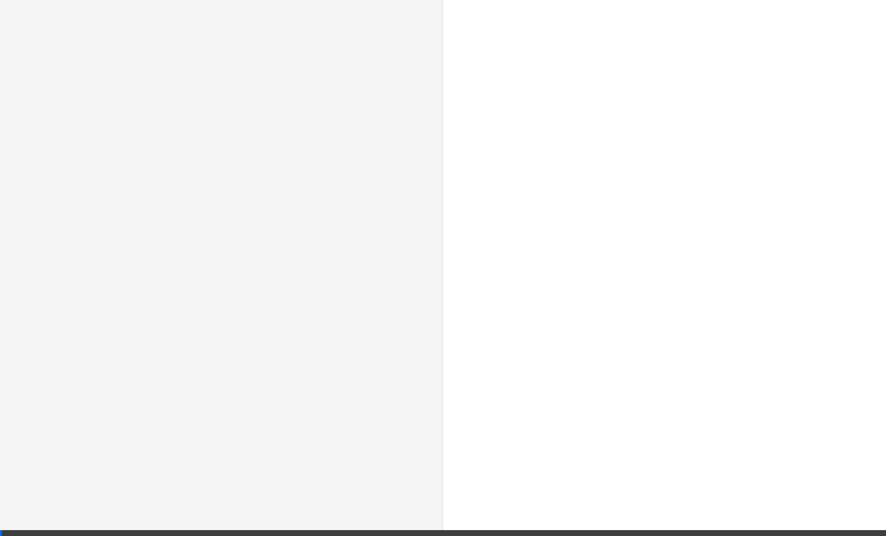

# User Invitation System

This documentation covers the user invitation system that allows administrators to invite new users with pre-assigned roles.

## Features

- **Admin-created invitations** with role selection (Admin, Editor, User)
- **Email delivery** via Resend (optional)
- **Token-based accept URLs** with 7-day expiration
- **Invitation management**: resend, revoke, track status
- **Password validation** with real-time feedback

---

## Admin Flow

### 1. Create Invitation

Navigate to `/admin/users` and click the **Invite User** button:



### 2. Share the Link

After creation, copy the invitation link or let Resend send the email:



### 3. Manage Invitations

Use the **Invitations** tab to view status, resend, or revoke:



---

## Accept Invitation Flow

Invited users receive a link like:
```
https://your-domain.com/accept-invite/[uuid-token]
```

The page shows:
- Pre-filled email (read-only)
- Name field
- Password field with validation
- Role badge indicating their permissions

---

## Demo Videos

### Admin Creating Invitation


### User Accepting Invitation


---

## Setup

### Environment Variables

Add to your `.env`:

```env
# Optional - invitations work without this, but emails won't be sent
RESEND_API_KEY=re_xxxxxxxxxxxxx
RESEND_FROM_EMAIL=Shadower <noreply@yourdomain.com>
```

Get your API key from [resend.com/api-keys](https://resend.com/api-keys)

---

## Database

The invitation system uses the `user_invitation` table:

| Column | Type | Description |
|--------|------|-------------|
| id | uuid | Primary key |
| email | text | Invited email address |
| token | text | Unique invitation token |
| role | text | Pre-assigned role |
| invited_by | uuid | Admin user who created |
| expires_at | timestamp | Expiration (7 days) |
| accepted_at | timestamp | When accepted |
| revoked_at | timestamp | When revoked |
| created_at | timestamp | Creation time |

---

## API Endpoints

### Admin Actions (Protected)
- `createInvitationAction` - Create new invitation
- `revokeInvitationAction` - Revoke pending invitation  
- `resendInvitationAction` - Generate new token & send email

### Public API
- `GET /api/auth/accept-invitation?token=...` - Get invitation details
- `POST /api/auth/accept-invitation` - Accept and create account

---

## File Structure

```
src/
├── app/
│   ├── (auth)/accept-invite/[token]/page.tsx
│   └── api/
│       ├── admin/invitation-actions.ts
│       └── auth/accept-invitation/route.ts
├── components/
│   ├── admin/
│   │   ├── invite-user-dialog.tsx
│   │   ├── pending-invitations-table.tsx
│   │   └── admin-users-tabs.tsx
│   └── auth/
│       ├── accept-invite-form.tsx
│       └── invalid-invitation.tsx
├── lib/
│   ├── admin/invitation-server.ts
│   ├── db/pg/repositories/invitation-repository.pg.ts
│   └── email/resend.ts
└── types/invitation.ts
```
